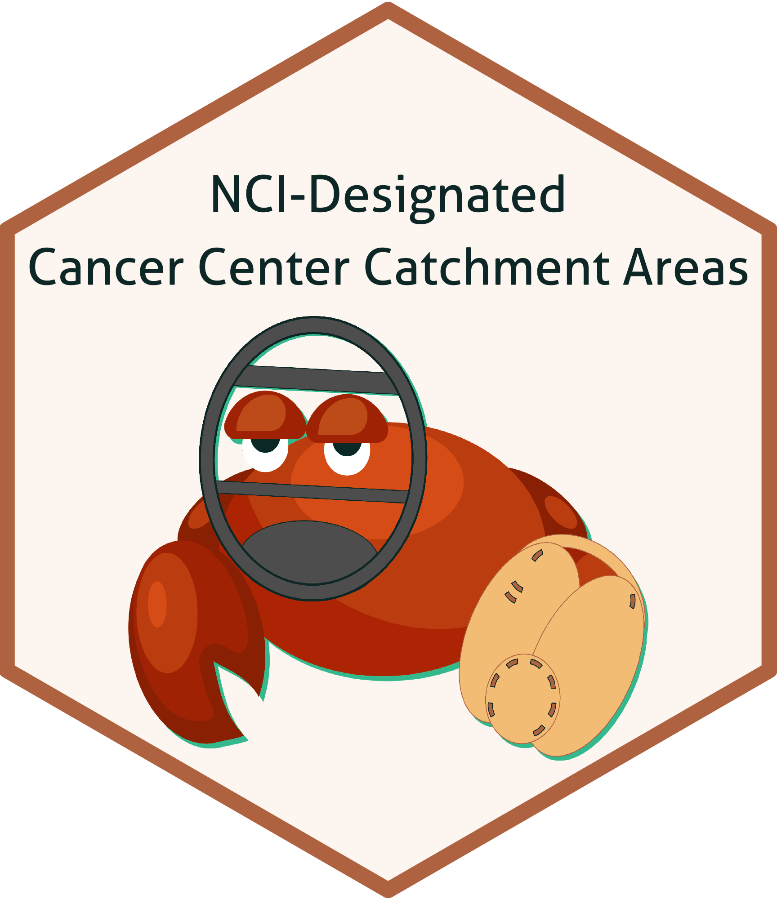

A National Map of NCI-Designated Cancer Center Catchment Areas on the 50th Anniversary of the Cancer Centers Program 
===================================================

**Date repository last updated**: May 11, 2022

### Authors

* **Peter F. DelNero**1,2 - *Co-First Author* - [ORCID](https://orcid.org/0000-0002-8149-9004)
* **Ian D. Buller**1,3 - *Co-First Author* - [ORCID](https://orcid.org/0000-0001-9477-8582)
* **Rena R. Jones**3 - [ORCID](https://orcid.org/0000-0003-1294-1679)
* **Zaria Tatalovich**4
* **Robin C. Vanderpool**5 - *Corresponding Author* - [ORCID](https://orcid.org/0000-0001-9995-4485)
* **Henry P. Ciolino**6 - *Co-Senior Author* - [ORCID](https://orcid.org/0000-0002-1173-8372)
* **Robert T. Croyle**7 - *Co-Senior Author* - [ORCID](https://orcid.org/0000-0002-8657-9441)

1.	Cancer Prevention Fellowship Program, Division of Cancer Prevention, National Cancer Institute, Rockville, MD, 20850, USA
2.	Implementation Science, Office of the Director, Division of Cancer Control and Population Sciences, National Cancer Institute, Rockville, MD, 20850, USA
3.	Occupational and Environmental Epidemiology Branch, Division of Cancer Epidemiology and Genetics, National Cancer Institute, Rockville, MD, 20850, USA
4.	Statistical Research & Applications Branch, Surveillance Research Program, Division of Cancer Control and Population Sciences, National Cancer Institute, Rockville, MD, 20850, USA
5.	Health Communication and Informatics Research Branch, Behavioral Research Program, Division of Cancer Control and Population Sciences, National Cancer Institute, Rockville, MD, 20850, USA
6.	Office of Cancer Centers, National Cancer Institute, Rockville, MD, 20850, USA
7.	Division of Cancer Control and Population Sciences, National Cancer Institute, Rockville, MD, 20850, USA

### Project Details
The National Cancer Act of 1971 created a process to recognize the leadership, facilities, and research efforts at cancer centers in the United States. National Cancer Institute (NCI)-Designated Cancer Centers define and describe a catchment area that they tailor specific scientific and community engagement activities. We geographically define and display a national map of 63 NCI-Designated Cancer Center catchment areas as well as demonstrate how publicly available data sets can be linked to each catchment area. 

### Project Timeframe

<table>
<colgroup>
<col width="20%" />
<col width="80%" />
</colgroup>
<thead>
<tr class="header">
<th>Time</th>
<th>Event</th>
</tr>
</thead>
<tbody>
<td>
2016-2021
</td>
<td>Fiscal years of the <a href="https://www.cancer.gov/research/infrastructure/cancer-centers/">P30 Cancer Center Support Grant</a> with NCI-Designated Cancer Center catchment areas</td>
</tr>
<td>
2015-2019
</td>
<td><a href="https://www.census.gov/newsroom/press-kits/2020/acs-5-year.html/">U.S. Census Bureau American Community Survey</a> used for data linkages</td>
</tr>
<td>
2018
</td>
<td><a href="https://www.census.gov/geographies/mapping-files/time-series/geo/tiger-line-file.2018.html/">U.S. Census Bureau Topologically Integrated Geographic Encoding and Referencing (TIGER)/Line</a> database used for generating the NCI-Designated Cancer Center catchment area boundaries</td>
</tr>
<td>
March 2020
</td>
<td>Project Initiation</td>
</tr>
<td>
May 2021
</td>
<td>NCI-Designated Cancer Center directors were asked for updates to their center's catchment area definition</td>
</tr>
<td>
October 2021
</td>
<td>Initial manuscript submission to <a href="https://cebp.aacrjournals.org/">Cancer Epidemiology, Biomarkers & Prevention</a> for peer-review</td>
</tr>
<td>
January 2022
</td>
<td>Manuscript accepted by <a href="https://cebp.aacrjournals.org/">Cancer Epidemiology, Biomarkers & Prevention</a> and launch of the <a href="https://gis.cancer.gov/ncicatchment/">Catchment Areas of NCI-Designated Cancer Centers</a> web application (see data availability section below).</td>
</tr>
</tr>
<td>
May 2022
</td>
<td>Manuscript published in <a href="https://doi.org/10.1158/1055-9965.EPI-21-1230">Cancer Epidemiology, Biomarkers & Prevention</a>. Featured as the cover article for <a href="https://aacrjournals.org/cebp/issue/31/5">Volume 31, Issue 5</a>. </a></td>.
</tr>
</tbody>
<table>

### R Scripts Included In This Repository

This repository includes R-scripts use to render the geographical figures found in the following peer-reviewed manuscript:

DelNero PF, Buller ID, Jones RR, Tatalovich Z, Vanderpool RC, Ciolino HP, Croyle RT. (2022) A National Map of NCI-Designated Cancer Center Catchment Areas on the 50th Anniversary of the Cancer Centers Program. _Cancer Epidemiology, Biomarkers & Prevention_, 31(5):965-971. DOI:<a href="https://doi.org/10.1158/1055-9965.EPI-21-1230">10.1158/1055-9965.EPI-21-1230</a> PMID: <a href="https://pubmed.ncbi.nlm.nih.gov/35101903/">35101903</a>

with a suggested in-text citation as: (DelNero & Buller _et al._, 2022) as DelNero and Buller contributed equally to the manuscript.

<table>
<colgroup>
<col width="20%" />
<col width="80%" />
</colgroup>
<thead>
<tr class="header">
<th>R Script</th>
<th>Description</th>
</tr>
</thead>
<tbody>
<td>
<code>Catchments.R</code></td>
<td>Generate the NCI-Designated Cancer Center catchment areas. Requires two data sets to run (not included; see notes within or in the data availability section below).</td>
</tr>
<td>
<code>Figure1.R</code>
</td>
<td>Generate Figure 1</td>
</tr>
<td>
<code>Figure2.R</code>
</td>
<td>Generate Figure 2</td>
</tr>
<td>
<code>Figure3.R</code>
</td>
<td>Generate Figure 3</td>
</tr>
<td>
<code>Supplemental1.R</code>
</td>
<td>Generate Supplemental Figure 1</td>
</tr>
<td>
<code>Supplemental2.R</code>
</td>
<td>Generate Supplemental Figure 2</td>
</tr>
<td>
<code>Supplemental3.R</code>
</td>
<td>Generate Supplemental Figure 3</td>
</tr>
</tbody>
<table>

The repository also includes the code and resources to create the project hexsticker.

### Data Availability

Shapefiles for the NCI-Designated Cancer Center locations and catchment areas are available for download from the [Catchment Areas of NCI-Designated Cancer Centers](https://gis.cancer.gov/ncicatchment/) web application hosted on the [GIS Portal for Cancer Research](https://gis.cancer.gov/) by the [National Cancer Institute](https://www.cancer.gov/).

### Questions?

For questions about the manuscript or NCI-Designated Cancer Center catchment areas please e-mail the corresponding author [Dr. Robin C. Vanderpool](mailto:robin.vanderpool@nih.gov)
